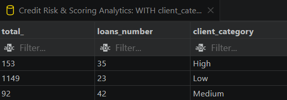

# Credit Risk & Borrower Scoring Analytics

An end-to-end data analytics project simulating a banking risk-management environment. It covers data validation in PostgreSQL, Star Schema modeling, and interactive visualization in Power BI.

## 🛠️ Tech Stack
* **Database:** PostgreSQL (CTEs, CASE WHEN, Joins, Filters)
* **BI & Data Modeling:** Power BI Desktop (Star Schema, DAX measures)
* **Design:** Financial Dark-Mode Dashboard Optimization

## 📊 Dashboard Preview


## 💡 Key Insights Discovered
* **The Risk Paradox:** The **Low Credit Score** segment represents the lowest volume of issued loans, yet it exhibits an exponential surge in `Average Delinquency Days`.
* **Collateral Risk:** Borrowers who **Rent** or have an active **Mortgage** demonstrate lower payment discipline than outright property owners.
* **Toxic Capital Outflow:** Loans allocated for **Education** and **Personal** reasons carry the highest concentration of defaulted, toxic capital.

## 💻 SQL Analysis & Data Verification
To ensure data integrity, metrics were extracted and verified using PostgreSQL. Below are the analytical queries and their corresponding database outputs:

<details>
<summary><b>1. Credit Scoring & Risk Segmentation (Click to expand)</b></summary>

```sql
WITH client_categories AS (
    SELECT 
    customer_id
    , CASE
        WHEN credit_score > 700 THEN 'High'
        WHEN credit_score BETWEEN 600 AND 700 THEN 'Medium'
        ELSE 'Low'
      END AS cat
FROM dim_customers
)
SELECT 
    SUM(fl.days_past_due) AS total_
    
    , COUNT(fl.loan_id) AS loans_number
    , cc.cat AS client_category
FROM fact_loans AS fl
JOIN client_categories AS cc ON fl.customer_id = cc.customer_id
GROUP BY cc.cat;
```

</details>
## 📂 Quick Structure
* `/SQL_files` — queries for data audit and segmentation.
* `/PowerBIfiles` — interactive `.pbix` dashboard file with image.
